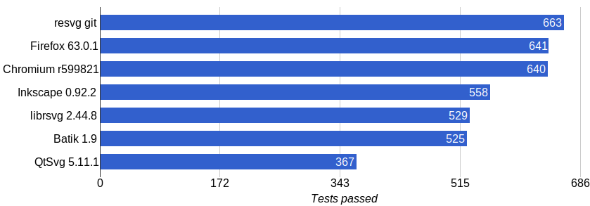
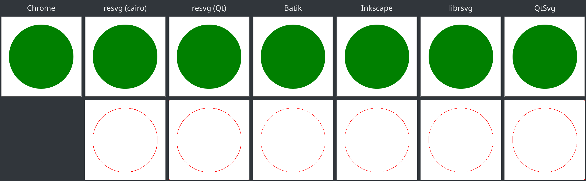

:showtitle:
:page-title: SVG 1.1 Full Static Support
:stylesheet: style.css

= SVG 1.1 Full Static Support
:toc:
:toc-title:

== About

This page contains results of the https://github.com/RazrFalcon/resvg-test-suite[resvg test suite]
which is specifically designed for the https://github.com/RazrFalcon/resvg[resvg] library.

=== Test suite design

* One file - one test. +
  In the official test suite, one file can have a lot of tests.
* More edge-cases. +
  Unlike the official https://www.w3.org/Graphics/SVG/Test/20110816/[SVG test suite].
* Only supported SVG subset. +
  _resvg_ trying to support only the https://www.w3.org/TR/SVG11/feature#SVG-static[static] SVG subset.
* Tests are grouped by the element and attribute names.

=== What we don't test

* Features that isn't yet implemented in the _resvg_.
* XML parsing. +
  Except some DTD and namespace resolving we assume that SVG library supports full XML 1.0 spec.
* Extended CSS support. +
  In the _resvg_ case CSS parsing is done on the https://github.com/RazrFalcon/libsvgdom[svgdom] side.
  And we support only a minimal CSS subset.
* Extended raster image formats features. +
  We assume that underlying PNG and JPEG libraries are good.
* `a` element. We treating it as `g`.
* Pointer events.
* Animations.
* Scripting.
* Embedded fonts.

=== Other SVG libraries and applications

We are testing/comparing _resvg_ with Chrome, Inkscape, librsvg and QtSvg for a reason.

* Chrome has the best SVG support so far.
* Batik is the most popular Java library for SVG rendering.
* Inkscape is an obvious choice on Linux.
* librsvg is the main _resvg_ rival. Used in GNOME, XFCE for SVG rendering.
* QtSvg is used by all the Qt applications and KDE.

=== Tests summary

=== Legend

++++
include::legend.html[]
++++

Rows like this indicate that such element/attribute is planned but not yet implemented.

[cols="1,10,^1,^1,^1,^1,^1,^1"]
|===
2+| name ^||||||
|===

== Elements

++++
include::autogen-elements-table.html[]
++++

== Attributes

=== Presentation

++++
include::autogen-presentation-attributes-table.html[]
++++

=== Other

++++
include::autogen-attributes-table.html[]
++++

== Tests

:3H: ###

Test files can be found https://github.com/RazrFalcon/resvg-test-suite/tree/master/svg[here].

Naming convention: `type`-`name`-`{3H}`.svg

`type` can be either `a`(attribute) or `e`(element).

For example the _polyline - 3. Ignore odd points_ will lead to `e-polyline-003.svg`.

== Additional notes

// TODO: add kerning image

* _batik_ doesn't support anti-aliasing during `clipPath`, but we are ignoring this.
* _batik_ doesn't support text kerning,
  so characters will be aligned incorrectly, but we are ignoring this because otherwise we have to
  mark all text-based test as failed, which is not fair.
* All libraries are rendering text a bit different. We do not treat this as an error.
* Some tests are marked as UB (undefined behavior). This means that I don't know how the correct
  result should look like. Usually, all libraries will render those files differently.
  Those tests are marked as *Unknown*, but they must not crash anyway.
* Every application and library are rendering the basic shapes a bit differently.
  We do not treat this as an error.
  
