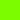
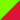
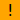

:showtitle:
:page-title: SVG 1.1 Full Support

:ok-box: pass:[]
:fail-box: pass:[]
:part-box: pass:[]
:unk-box: pass:[image:images/unknown.svg[20,20, title="Unknown"]]
:crash-box: pass:[]
:oos-box: pass:[]

= SVG 1.1 Full Support
:toc:

Legend

[cols="^1,20"]
|===
| {ok-box}    | Passed
| {fail-box}  | Failed
| {part-box}  | Partial
| {unk-box}   | Unknown
| {crash-box} | Crashed
| {oos-box}   | Out of scope
|===

== Elements

// we have to precede cells after span with ^| because of
// https://github.com/asciidoctor/asciidoctor/issues/989

include::elements-table.adoc[]

== Attributes

=== Presentation

include::attributes-table.adoc[]

=== Other

|===
|Attribute |resvg |Inkscape |librsvg |QtSvg |Tests
|`preserveAspectRatio` |No |Yes |? |No |
|`xml:space` |Yes |Partial |Partial |No |
|`requiredFeatures` |Partial |? |? |? |
| 5+|Not supported footnoteref:[not-supported]: +
- on any element which is not a direct `switch` child
|`requiredExtensions` |Partial |? |? |? |
| 5+|Not supported footnoteref:[not-supported]: +
- on any element which is not a direct `switch` child
|`systemLanguage` |Partial |? |? |? |
| 5+|Not supported footnoteref:[not-supported]: +
- on any element which is not a direct `switch` child
|===

=== Paint value

|===
|Spec |Example |resvg |Inkscape |librsvg |QtSvg |Tests
|`none` |`none ^| {unk-box}  | {unk-box}  | {unk-box}  | {unk-box}  | {unk-box}
|`currentColor` |`currentColor ^| {unk-box}  | {unk-box}  | {unk-box}  | {unk-box}  | {unk-box}
|`<color>` |`red ^| {unk-box}  | {unk-box}  | {unk-box}  | {unk-box}  | {unk-box}
|`<color>` |`#ff0000 ^| {unk-box}  | {unk-box}  | {unk-box}  | {unk-box}  | {unk-box}
|`<color>{nbsp}<icccolor>` |`steelblue icc-color(cmyk,{nbsp}0.8,{nbsp}0.1745,{nbsp}0.098,{nbsp}0.2) ^| {unk-box}  | {unk-box}  | {unk-box}  | {unk-box}  | {unk-box}
|`<funciri>` |`uri(#pat) ^| {unk-box}  | {unk-box}  | {unk-box}  | {unk-box}  | {unk-box}
|`<funciri>{nbsp}<color>`|`uri(#pat) #f0f`  ^| {unk-box}  | {unk-box}  | {unk-box}  | {unk-box}  | {unk-box}
|`<funciri>{nbsp}<color>{nbsp}<icccolor>`|`uri(#pat) #f0f icc-color(myprofile,{nbsp}.1,{nbsp}.3) ^| {unk-box}  | {unk-box}  | {unk-box}  | {unk-box}  | {unk-box}
|`inherit` |`inherit ^| {unk-box}  | {unk-box}  | {unk-box}  | {unk-box}  | {unk-box}
|===

// TODO:
// Custom namespace
// Non-UTF-8 encoding
// Element referencing from ENTITY  coords-viewattr-01-b.svg

== Tests

Test files has a folowing nameing convention: `%type%`-`%element name%`-`%consecutive number%`.svg

== Notes

- If element or attribute is marked as supported it doesn't mean that it's 100% supported.
  Maybe I just don't know about some edge cases that should be supported.

Last update: 2018-02-23
