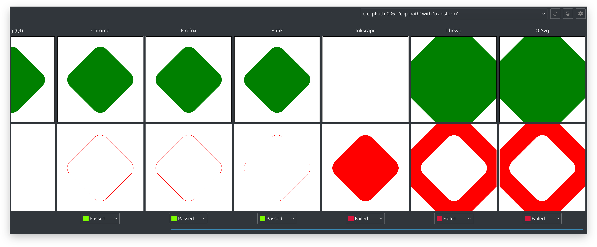

# vdiff

Show visual differences of the SVG file rendered using different libraries.



## Dependencies

- Qt 5
- node.js for `../chrome-svgrender`
- (optional) Inkscape
- (optional) librsvg
- (optional) Batik (Java)
- (optional) wxSVG

## Build

You should build `../chrome-svgrender`, `../qtsvgrender` and `../wxsvgrender` first.

```bash
qmake
make
```
